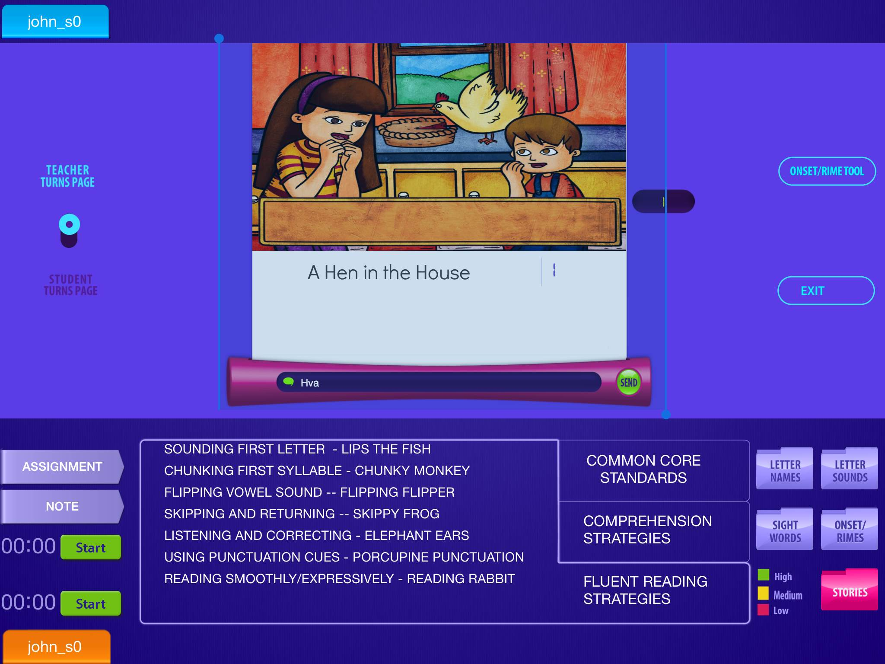

## Bug #1

* **App**: TeacherMate - Teacher Small Group and Student Small Group
* **Activity**: Stories - Teacher Messages
* **Problem**: Messages not sent from teacher to student with **Send** button
* **Notes**: Seems to work with keyboard **Return** key
* **Device**: iPad Mini on Teacher side

## Bug #2

* **App**: TeacherMate - Teacher Small Group and Student Small Group
* **Activity**: Stories - Student Messages
* **Problem**: Follow initial message sent successfully with Send button subsequent taps of Send button cause blue lines terminated with filled blue circle to appear and messages are not sent.
* **Device**: regular iPad on Teacher side
* 

## Bug #3

* **App**: TeacherMate - Teacher Small Group and Student Small Group
* **Activity**: Stories - Student Messages
* **Problem**: Text is not aligned within messaging field
* **Device**: regular iPad on Student side

## Bug #4

* **App**: TeacherMate - Teacher Small Group and Student Small Group
* **Activity**: Stories - Common Core Standards
* **Problem**: `Experience's` should be spelled `Experiences`

## Bug #5

* **App**: TeacherMate - Teacher Small Group and Student Small Group
* **Activity**: Stories - Student Page Turning
* **Problem**: If setting is switched to Student Turns Page, Teacher cannot switch back to Teacher Turns Page
* **Device**: iPad Mini on Teacher side

## Bug #6

* **App**: TeacherMate - Teacher Small Group (no student logged in)
* **Activity**: All Activities
* **Problem**: Timers do not work

## Bug #7

* **App**: TeacherMate - Teacher Notepad
* **Activity**: Partner Station Scoring
* **Problem**: Remove Conf Order column

## Bug #8

* **App**: TeacherMate - Teacher Notepad
* **Activity**: Partner Station Scoring
* **Problem**: Scores should be down synced on entry and up synced on exit of screen